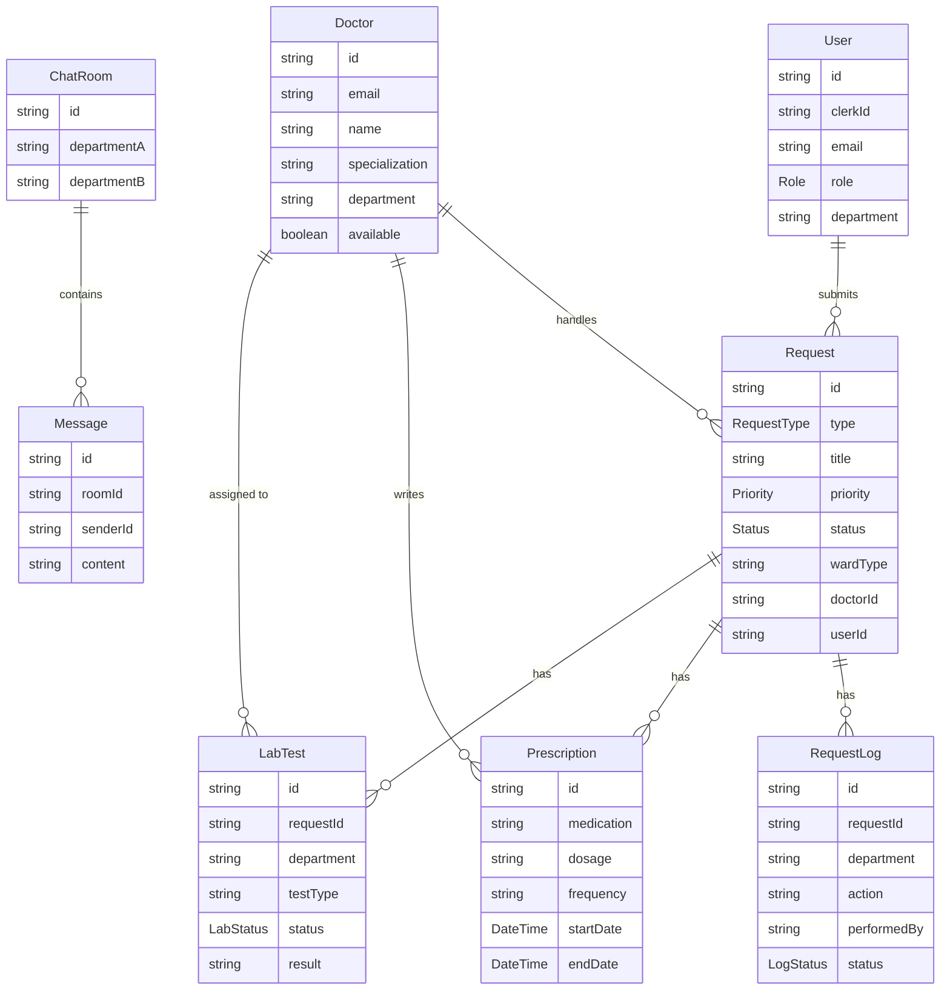

# TurboS — Hospital Inter-Department Workflow Automation System

**Live Application:** https://turbo-s-final.vercel.app/


### Login Credentials

| Role   | Email                    | Password   |
|--------|--------------------------|------------|
| Doctor | ananya@mediflow.com      | doctor123  |
| Lab    | bloodlab@hospital.com    | lab123     |

> Doctor email format: `{first_name}@mediflow.com`

---

## Features

### 1. Patient Query & Appointment Interface

Patients submit healthcare-related queries and request appointments through a clear, structured interface that handles four request types:

- **Appointments** — Select department, preferred doctor, date/time slot, and describe symptoms
- **Emergencies** — Instant triage with auto-assignment to the nearest available emergency doctor
- **Lab Tests** — Request specific diagnostic tests (Radiology, Pathology, Blood Lab, Cardiac Lab)
- **Room Bookings** — Reserve hospital rooms tied to active cases

Every submission creates a tracked `Request` record and an automatic `Bill` with the corresponding charges. Emergency requests bypass scheduling and are assigned immediately.

### 2. Secure Authentication & Access Control for Healthcare Systems

Role-based access control protects patient information and enforces department-scoped permissions:

| Role   | Auth Method | Access Scope                                         |
|--------|-------------|------------------------------------------------------|
| Patient | Clerk       | Own requests, prescriptions, health status           |
| Staff   | Clerk       | Department-scoped view and management                |
| Admin   | JWT         | Full access — all departments, users, system config  |
| Doctor  | JWT         | Assigned cases, department chat, lab management      |

- Patients authenticate through **Clerk** (SSO, social login, email)
- Doctors use a **JWT-based** custom login that integrates with the WebSocket server
- The JWT secret is shared between the Next.js app and the Socket.IO server, so tokens issued by the API are accepted by the real-time chat layer
- Every API endpoint enforces role checks before processing any data

### 3. Inter-Department Workflow Automation

A backend system routes patient queries across hospital departments using defined workflows. Every action is logged, every handoff is tracked, and the full journey is visible in real-time.

**Complete Workflow Lifecycle:**

```
Patient Submits Request
    → System Auto-Assigns Doctor (by department + availability)
        → Doctor Reviews Case
            → Admit / Refer / Transfer Ward / Order Lab Test / Prescribe / Discharge
                → Each action creates a timestamped RequestLog entry
                    → Side Panel updates live across all views
```

**Key Workflow Capabilities:**
- **Referral** — Transfer case ownership to a specialist in another department. The referring doctor retains read-only access; the new doctor gains full action permissions.
- **Ward Transfer** — Move patients between units (e.g., General → ICU) with full audit trail.
- **Lab Test Ordering** — Order diagnostics assigned to lab-specific doctors. Tests track through PENDING → IN_PROGRESS → COMPLETED with results visible to the treating doctor.
- **Prescription Management** — Issue prescriptions (medication, dosage, frequency, date range) linked to the patient's active case.
- **Discharge** — Formally close the case, archive it in patient history, and update doctor availability.

**Live Activity Feed & Side Panel:**
A collapsible side panel available on every page provides two views:
- **Request Flow** — Chronological timeline of every action on a case, tagged by department and actor
- **Activity Log** — Reverse-chronological list of all backend API interactions with HTTP methods, status codes, and endpoint tracing

### 4. Administrative Analytics Dashboard

Hospital administrators get structured visibility into operational activity:

- **Real-time request overview** — Active, pending, and completed cases across all departments
- **Department workload distribution** — See which departments are handling the most cases
- **Doctor management panel** — Create, update, and deactivate doctor accounts with department and specialization metadata
- **Staff and user management** — Role assignment and access control from a centralized admin view
- **Billing and payment tracking** — Monitor auto-generated bills and Razorpay payment statuses

### 5. AI-Based Response Suggestions

AI tools integrated directly into the doctor's workflow to assist with clinical decisions:

- **Skin Cancer Classifier** — Drag-and-drop image upload with real-time classification powered by a Hugging Face ML model. Results show disease label and confidence scores. A fallback Streamlit app is also linked.
- **Gemini AI Consultation** — Doctors can consult Google's Gemini AI for clinical suggestions and second opinions, accessible from the dashboard.

These tools support review and editing rather than fully automated replies — doctors always make the final call.

### 6. Clinical Decision Support

Rule-based recommendations and warnings integrated into the patient workflow:

- **Priority-based triage** — Requests are tagged LOW / MEDIUM / HIGH / CRITICAL, with emergency cases surfaced prominently and handled first
- **Auto-assignment engine** — Matches patients to available doctors based on department, specialization, and current availability
- **Lab result integration** — Diagnostic results flow back to the treating doctor's view, informing next steps
- **Prescription conflict awareness** — Full medication history visible when prescribing, supporting informed decisions
- **Complete audit trail** — Every action logged with department, actor, timestamp, and API trace, enabling pattern recognition across cases

---

## Core Architecture

```
┌─────────────────────────────────────────────────────────┐
│                    Next.js Frontend                      │
│  Patient Dashboard  |  Doctor Portal  |  Admin Panel     │
└────────────────────────┬────────────────────────────────┘
                         │ HTTP (REST API)
┌────────────────────────▼────────────────────────────────┐
│               Next.js API Routes (App Router)            │
│  /api/request  |  /api/doctor/*  |  /api/lab/*           │
└────────────────────────┬────────────────────────────────┘
                         │ Prisma ORM
┌────────────────────────▼────────────────────────────────┐
│              NeonDB (PostgreSQL via Prisma)               │
│  Users | Doctors | Requests | RequestLogs                │
│  LabTests | Prescriptions | ChatRooms | Messages         │
└─────────────────────────────────────────────────────────┘
                         
┌─────────────────────────────────────────────────────────┐
│        Standalone WebSocket Server (Socket.IO)           │
│  Deployed on Render / Railway                            │
│  Handles: live chat, typing indicators, notifications    │
└─────────────────────────────────────────────────────────┘
```

---

## Screenshots


<br/>

<p align="center">
  
  &nbsp;&nbsp;
  
</p>

<br/>

<p align="center">
  
  &nbsp;&nbsp;
  
</p>

---

## Technology Stack

| Layer              | Technology                        |
|--------------------|-----------------------------------|
| Framework          | Next.js 16 (App Router)          |
| Language           | TypeScript                        |
| Database           | NeonDB (PostgreSQL)               |
| ORM                | Prisma                            |
| Auth (Patients)    | Clerk                             |
| Auth (Doctors)     | JWT (jsonwebtoken)                |
| Real-time Chat     | Socket.IO (standalone WS server)  |
| AI / ML            | Hugging Face, Google Gemini       |
| Payments           | Razorpay                          |
| Frontend Hosting   | Vercel                            |
| WS Hosting         | Render / Railway                  |
| Styling            | Tailwind CSS                      |

---

## Doctor Portal — Actions Summary

| Action        | Endpoint                      | Effect                                              |
|---------------|-------------------------------|-----------------------------------------------------|
| Admit         | PUT /api/doctor/admit         | Admits the patient for further in-hospital care     |
| Refer         | PUT /api/doctor/refer         | Transfers case ownership to another doctor/dept     |
| Transfer Ward | PUT /api/doctor/refer-ward    | Moves patient to a different ward                   |
| Order Test    | POST /api/doctor/order-test   | Creates a new lab test for the patient              |
| Prescribe     | POST /api/doctor/prescribe    | Issues a new prescription linked to the request     |
| Complete      | PUT /api/doctor/complete      | Marks the request as resolved                       |
| Discharge     | PUT /api/doctor/discharge     | Formally discharges the patient                     |

---

## Getting Started

### Prerequisites

- Node.js 18+
- NeonDB (or any PostgreSQL) database
- Clerk application with publishable and secret keys

### Installation

```bash
git clone https://github.com/jatinnathh/TurboS-Final.git
cd TurboS-Final

npm install

# Set up environment variables
cp .env.example .env
# Fill in DATABASE_URL, Clerk keys, JWT_SECRET, NEXT_PUBLIC_WS_URL

npx prisma db push
npx tsx prisma/seed.ts   # optional: seed initial data

npm run dev
```

### WebSocket Server (for real-time chat)

```bash
cd ws-server
npm install
# Set DATABASE_URL, JWT_SECRET, FRONTEND_URL in ws-server/.env
npm run dev
```

> The `JWT_SECRET` must be identical in both the Next.js app and the WebSocket server.

---

## Database Schema


